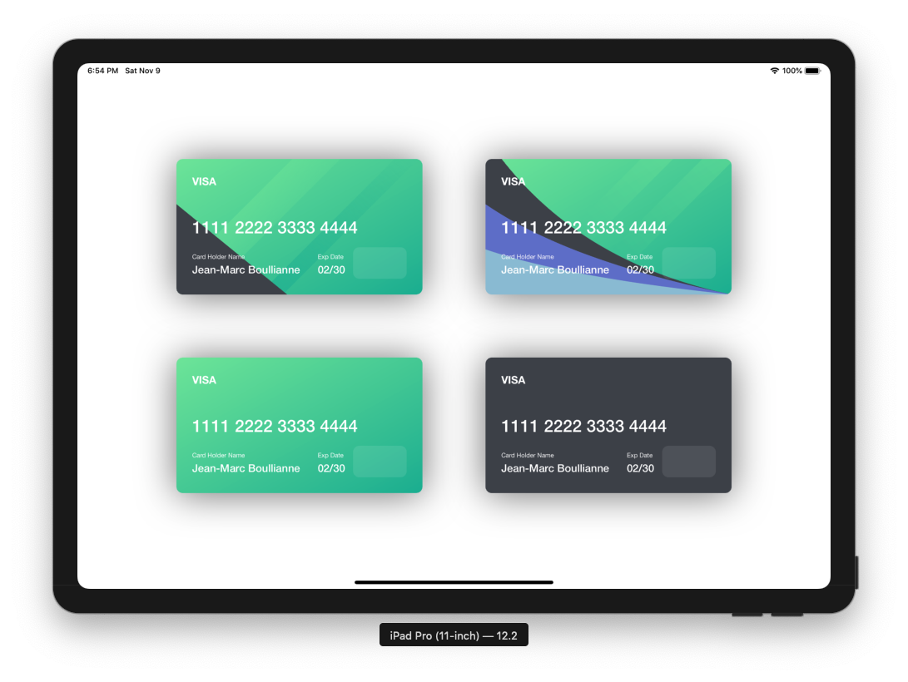
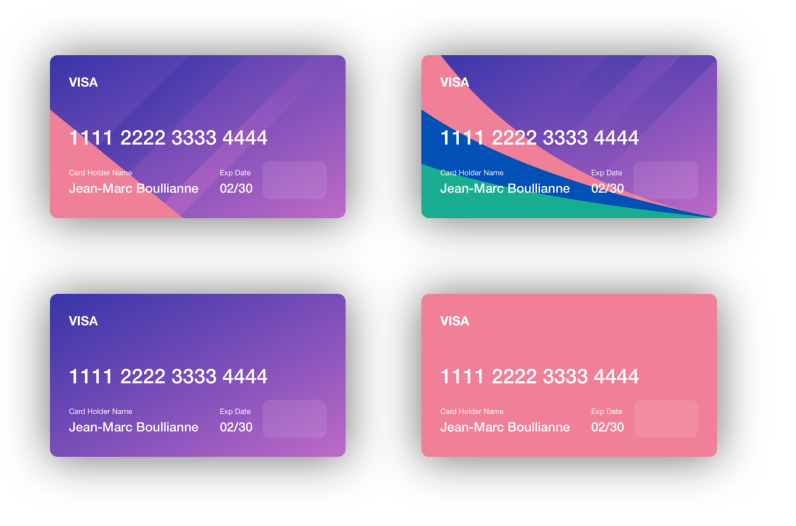
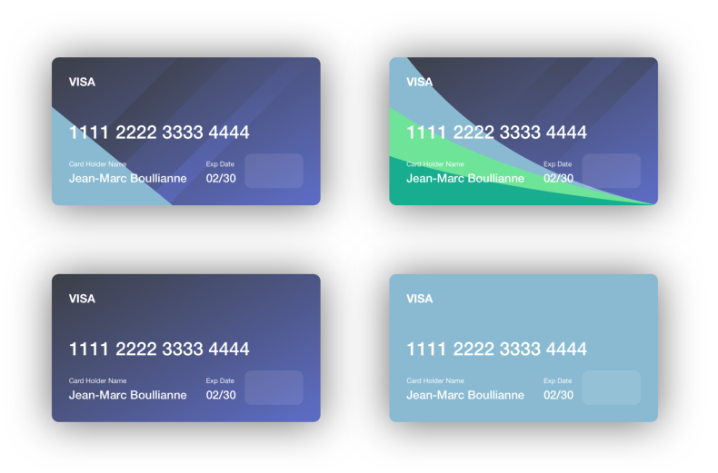

# CreditCardView

[](https://travis-ci.org/jboullianne/CreditCardView)
[](https://cocoapods.org/pods/CreditCardView)
[](https://cocoapods.org/pods/CreditCardView)
[](https://cocoapods.org/pods/CreditCardView)

## Example

To run the example project, clone the repo, and run `pod install` from the Example directory first.

## Screenshots


### Full Template Color Customization





## Requirements
Requires at least iOS 9.0.

## Installation

CreditCardView is available through [CocoaPods](https://cocoapods.org). To install
it, simply add the following line to your Podfile:

```ruby
pod 'CreditCardView'
```

## Using The CreditCardView
```swift
// Colors for Examples
let c1:UIColor = UIColor(rgb: 0x7CEA9C)
let c2:UIColor = UIColor(rgb: 0x2FB799)
let c3:UIColor = UIColor(rgb: 0x454851)
let c4:UIColor = UIColor(rgb: 0x6F73D2)
let c5:UIColor = UIColor(rgb: 0x98C1D9)

// Examples of Different Templates
// Basic - Template
card1 = CreditCardView(frame: CGRect(x: 0 y: 0, width: 390, height: 215), template: .Basic(c1, c2, c3))

// Curve - Template
card2 = CreditCardView(frame: CGRect(x: 0 y: 0, width: 390, height: 215), template: .Curve(c1, c2, c3, c4, c5))

// Gradient - Template
card3 = CreditCardView(frame: CGRect(x: 0 y: 0, width: 390, height: 215), template: .Gradient(c1, c2))

// Flat - Template
card4 = CreditCardView(frame: CGRect(x: 0 y: 0, width: 390, height: 215), template: .Flat(c3))    

// Change Card Details
creditCardView.nameLabel.text = "Jean-Marc Boullianne"
creditCardView.expLabel.text = "02/30"
creditCardView.numLabel.text = "1111 2222 3333 4444"
creditCardView.brandLabel.text = "VISA"
creditCardView.brandImageView.image = UIImage()

// You can also create your own custom background like this
creditCardView.backgroundView = //Custom Background View
```

## Author

jboullianne, jboullianne@gmail.com

## License

CreditCardView is available under the MIT license. See the LICENSE file for more info.
