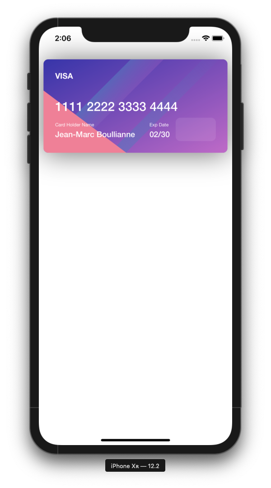

# CreditCardView

[](https://travis-ci.org/jboullianne/CreditCardView)
[](https://cocoapods.org/pods/CreditCardView)
[](https://cocoapods.org/pods/CreditCardView)
[](https://cocoapods.org/pods/CreditCardView)

## Example

To run the example project, clone the repo, and run `pod install` from the Example directory first.

## Screenshots


## Requirements
Requires at least iOS 9.0.

## Installation

CreditCardView is available through [CocoaPods](https://cocoapods.org). To install
it, simply add the following line to your Podfile:

```ruby
pod 'CreditCardView'
```

## Author

jboullianne, jboullianne@gmail.com

## License

CreditCardView is available under the MIT license. See the LICENSE file for more info.
